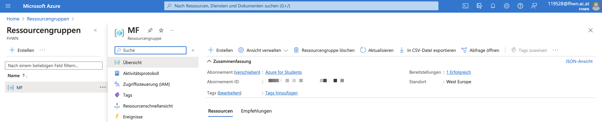
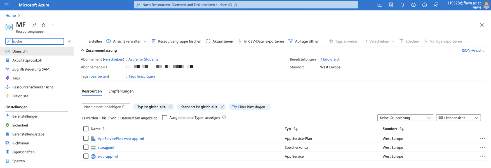
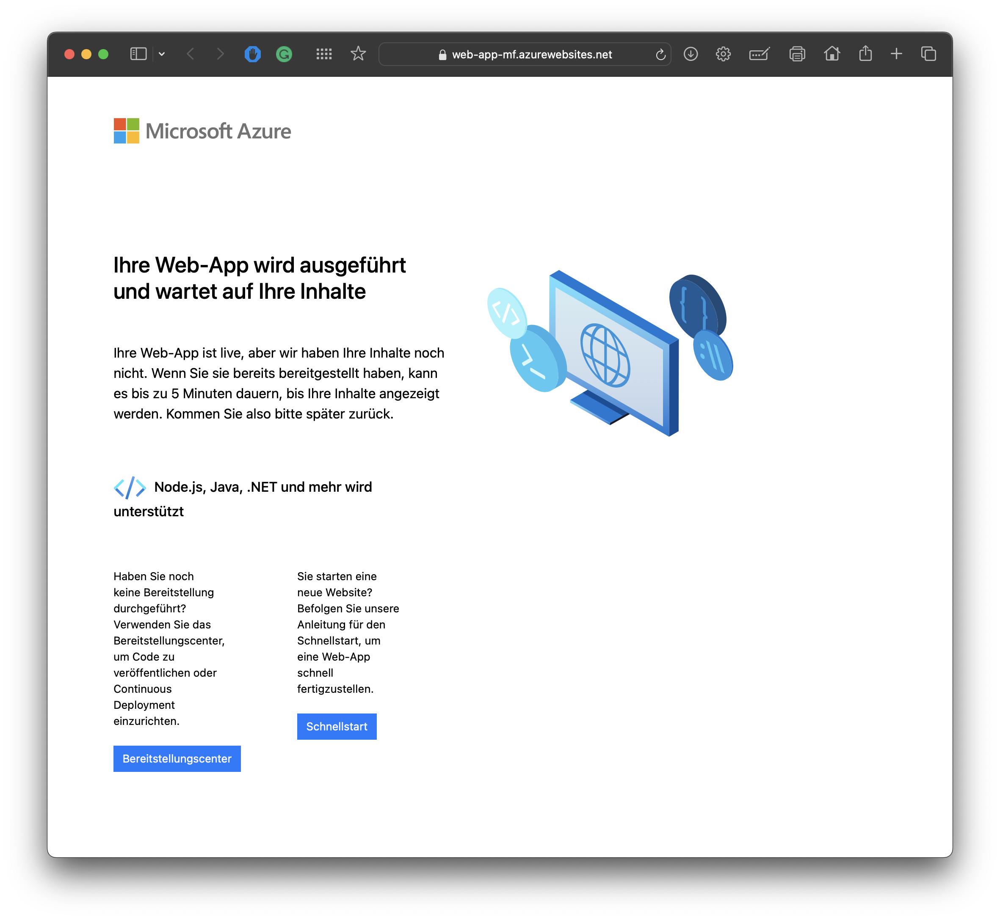

# Lab1 

ARM Template:
- Deploys an Azure Storage Account (Free Tier)
- Deploys an Azure Web-App (Free Tier) <br>

1. For the deployment you must have the Azure CLI (or alternatively Azure PowerShell) installed. <br>
Use of the [Azure CLI Docs](https://learn.microsoft.com/en-us/cli/azure/install-azure-cli) <br><br>

2. To log in to your account through the Azure CLI use the following command:
```Powershell
    az login
``` 

3. Then enter your username and password! <br><br>

4. If no resource-group has been created now, then may be created through the following Azure CLI command:
``` Powershell
    az group create --name <rgName> --location <example: 'westeurope'>
```

The following documentation was used for the use of the CLI command: <br>
[Azure CLI Resource Groups Docs](https://learn.microsoft.com/en-us/azure/azure-resource-manager/management/manage-resource-groups-cli)


1. The following template creates a Storage Account (Free Tier) as well as an Azure Web App (Free Tier) with the command:
```Powershell
az deployment group create --resource-group <rgName> --template-file "azuredeploy.json" --parameters "azuredeploy.parameters.json"
```





The following documentation was used for the correct use of ARM templates: 
[ARM template Docs](https://learn.microsoft.com/en-us/azure/azure-resource-manager/templates/overview)<br>
[ARM template Storage-Account Docs](https://learn.microsoft.com/en-us/azure/templates/microsoft.storage/storageaccounts?pivots=deployment-language-arm-template)<br>
[ARM template Web serverfarms Docs](https://learn.microsoft.com/en-us/azure/templates/microsoft.web/serverfarms?pivots=deployment-language-arm-template)<br>
[ARM template Web sites Docs](https://learn.microsoft.com/en-us/azure/templates/microsoft.web/sites?pivots=deployment-language-arm-template)


