# Lab2
[Lab2](#lab2)
- [Lab2](#lab2)
  - [General](#general)
  - [Info](#info)
  - [Steps](#steps)

## General

Building a DevOps pipeline based on Azuer DevOps using a Node.JS example.

- For the example a Node.Js application is to be built using Express. 
- This should be deplyoed using an Azuer DevOpps pipeline in an Azure Web App after each commit. 
- The Node.js application has to be equipped with test cases. In addition to the build pipeline, a release pipeline is also to be created, which ensures an automatic takeover of a release into production. 
- This is to be equipped with a manual check and should not be released after each build. Finally, the application should include Azure Application Insights.

## Info

Links to the azure web apps:
[Dev App](mfwebappnodejs-dev.azurewebsites.net)
[Production App](mfwebappnodejs-prod.azurewebsites.net)

## Steps


1. In the first step, a simple NodeJS application was created. Mathematical operators were implemented for the test cases and corresponding test cases were written. <br><br>

2. Then the Build and Deploy Pipeline was created. YAML File [here](../azure-pipelines.yml) <br><br>
   
3. For deploying on Azure, a service connection had to be created <br>
   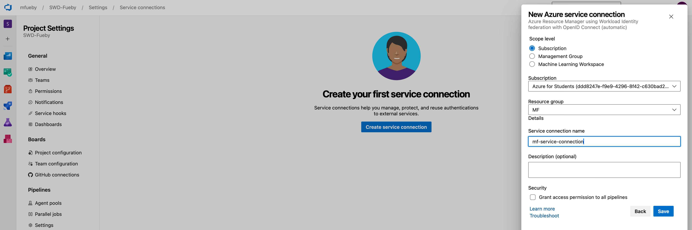 <br>

4. When starting the pipeline I got the following error: <br>
   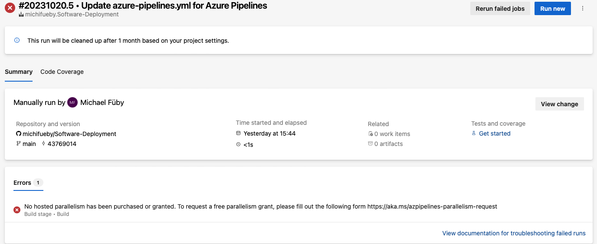 <br>
   After that I had to send a request to Microsoft for free parallelsim  <br>
   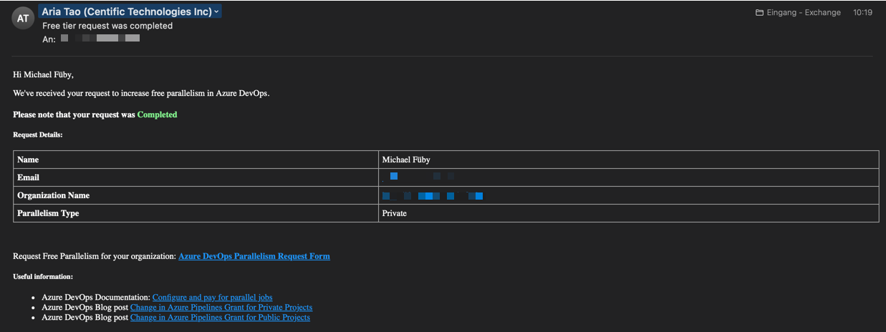 <br><br>

5. Then the Build was successful but the pipeline could not found the test-results.yaml. This issue was fixed by adjusting the search folder parameter. <b>
   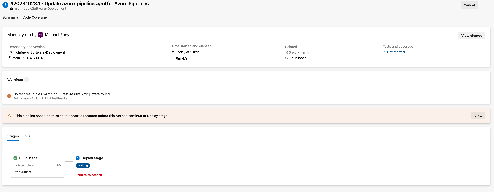 <br><br>

6. After that the Build Deploy Pipeline succeeded <br>
   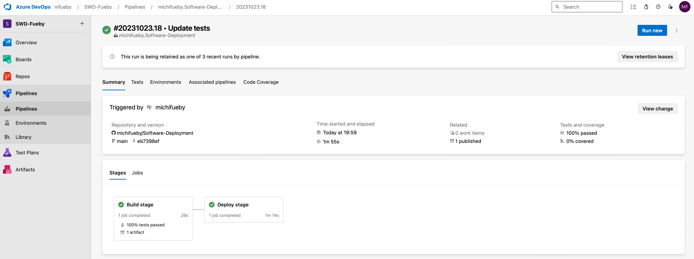 

   Test results: <br>
   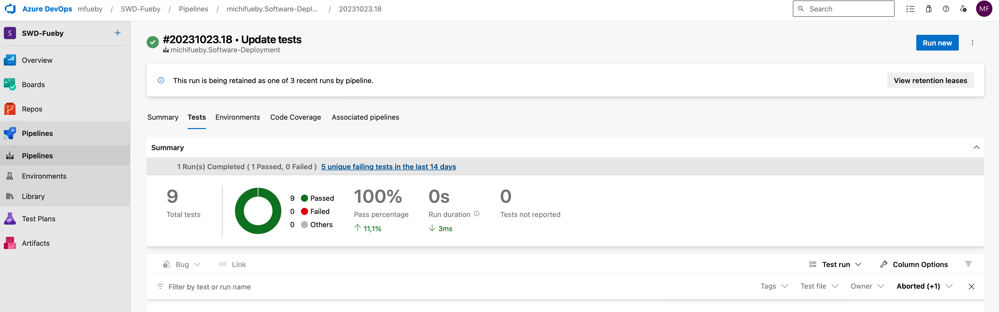 <br><br>

7. To create a release pipeline, the option "Disable creation of classic build pipelines" had to be activated in the organization settings. <br>
    
   
   After this setting, releases were visible under Pipelines <br>
   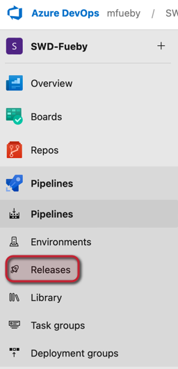 <br><br>

8. Furthermore the release pipeline could be created <br>
   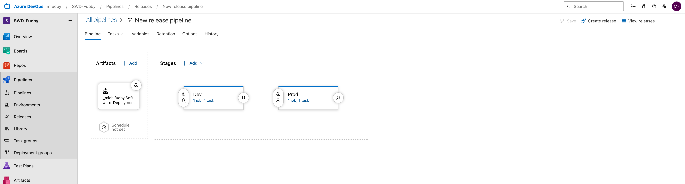 <br><br>

   Production Stage Pre Conditions Configuration: <br>
   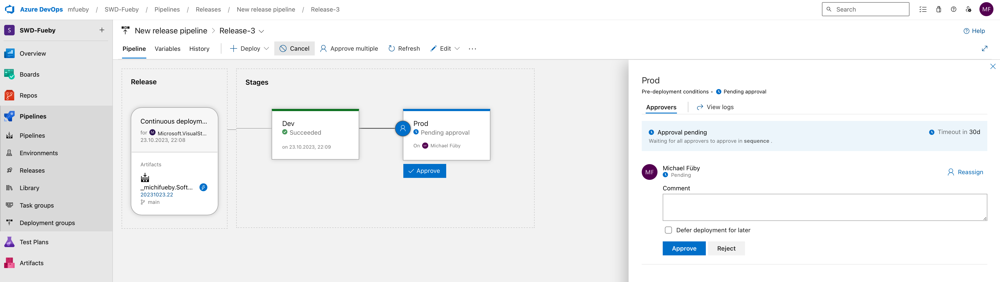 <br><br>

9.  Release Pipeline Dev started <br>
   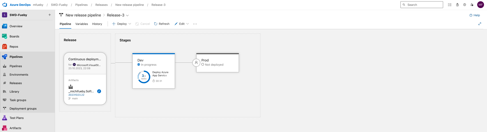

   Release Pipeline Dev succeded <br>
   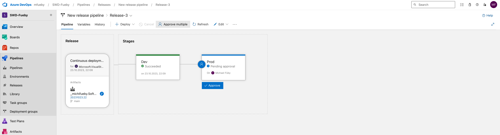 

   Release Pipeline Prod Approve <br>
   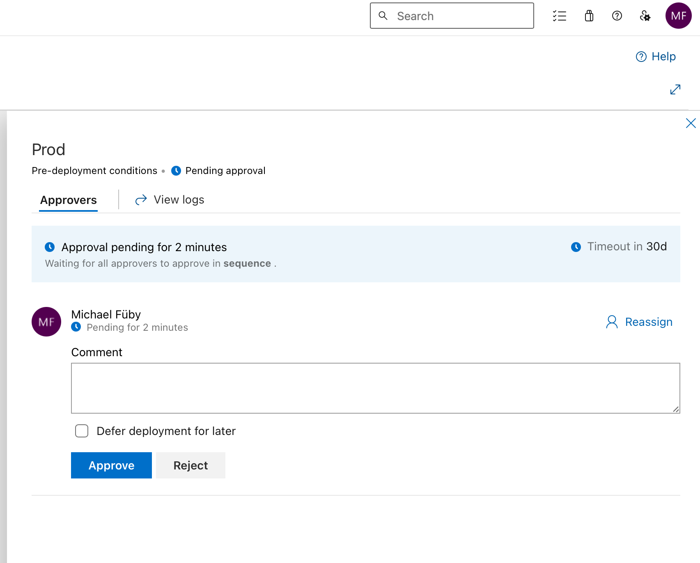 
   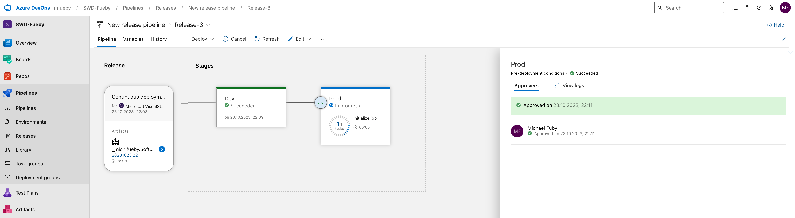 

   Release Pipeline Prod succeded <br>
   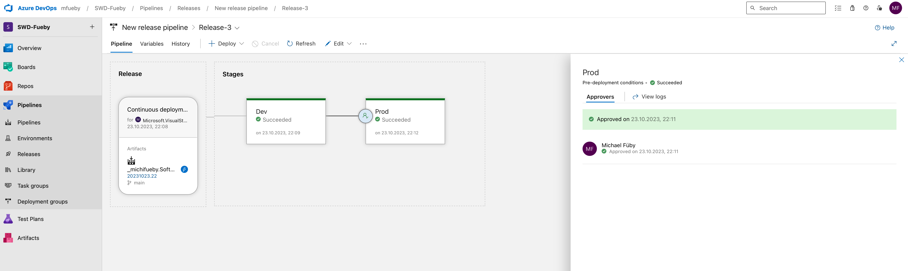

10. The release was successful <br>
   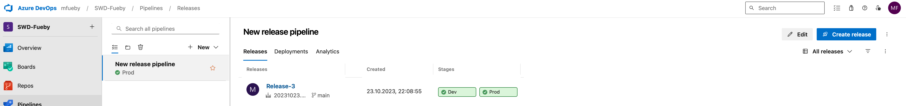<br><br>

11. You can see all releases <br>
   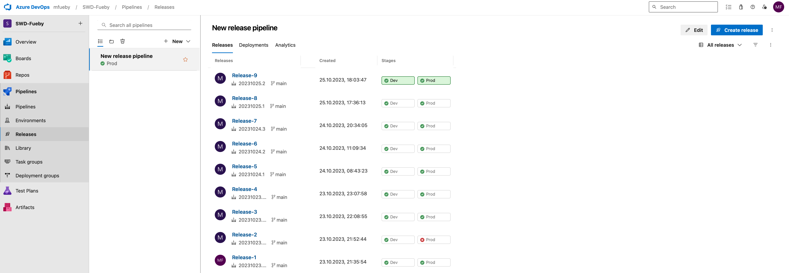 <br><br>

      The first thing I got was an Application Error from the Azure Web App <br>
      

      I used the protocol stream to find out the cause of the error

      Issue: The Web App found not the package.json

      To fix the error in the Azure portal had to add a application configuration with the name **PROJECT** and the Value ```<ROOT PATH>``` (for example: Lab2/app)</ROOT> <br>

      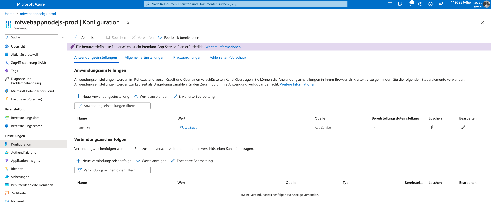 <br><br>

12. After the release on production:å
    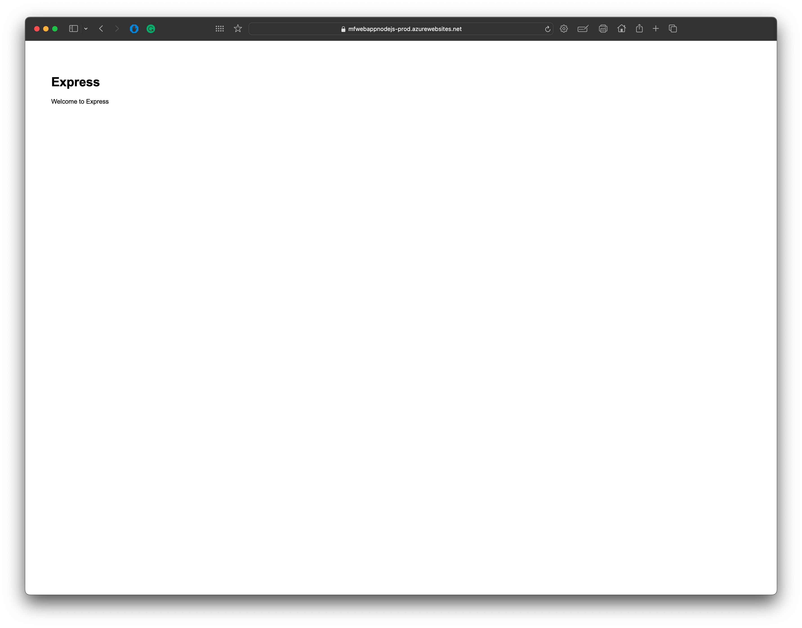 