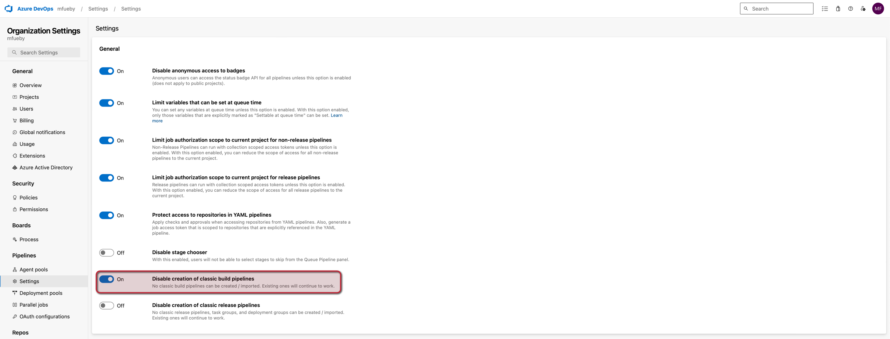

# Lab2

Building a DevOps pipeline based on Azuer DevOps using a Node.JS example.

- For the example a Node.Js application is to be built using Express. 
- This should be deplyoed using an Azuer DevOpps pipeline in an Azure Web App after each commit. 
- The Node.js application has to be equipped with test cases. In addition to the build pipeline, a release pipeline is also to be created, which ensures an automatic takeover of a release into production. 
- This is to be equipped with a manual check and should not be released after each build. Finally, the application should include Azure Application Insights.

1. In the first step, a simple NodeJS application was created. Mathematical operators were implemented for the test cases and corresponding test cases were written.   

2. Then the Build and Deploy Pipeline was created. YAML File [here](../azure-pipelines.yml)   

3. When starting the pipeline I got the following error:
     
   After that I had to send a request to Microsoft for free parallelsim 
      

4. Then the Build was successful but the pipeline could not found the test-results.yaml. This issue was fixed by adjusting the search folder parameter.
      

5. After that the Build Deploy Pipeline succeeded
    

   Test results:
      

6. To create a release pipeline, the option "Disable creation of classic build pipelines" had to be activated in the organization settings. 
    
   
   After this setting, releases were visible under Pipelines
      

7. Furthermore the release pipeline could be created 
      

   Prod Stage Pre Conditions Configuration:
      

8. Release Pipeline Dev started
   

   Release Pipeline Dev succeded
    

   Release Pipeline Prod Approve
    
    

   Release Pipeline Prod succeded
    

9. The release was successful
    