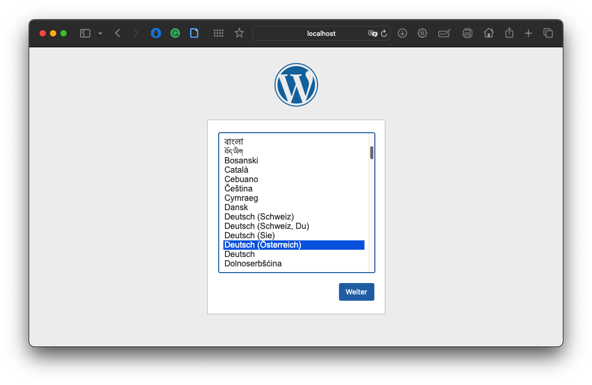
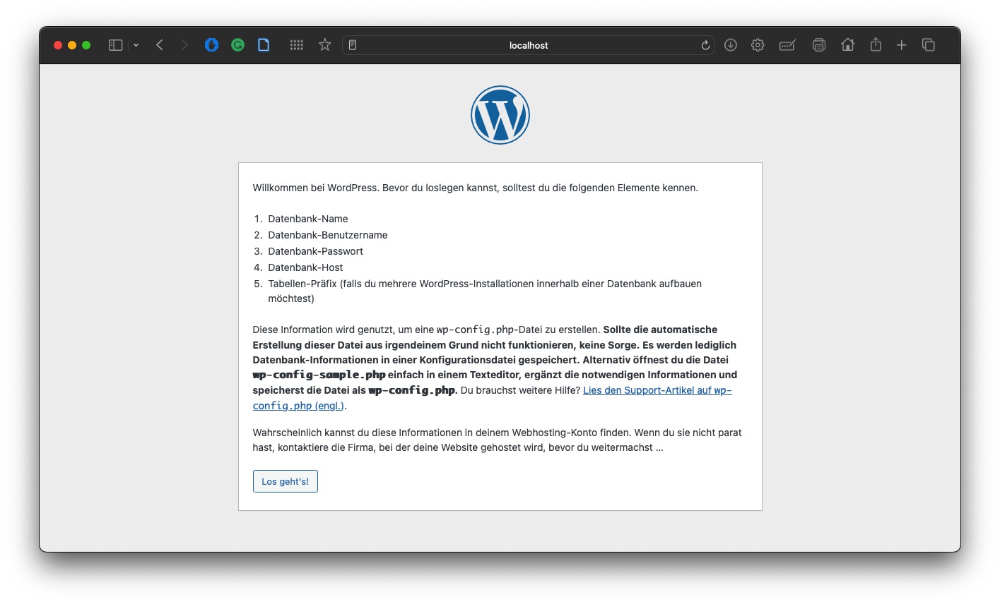
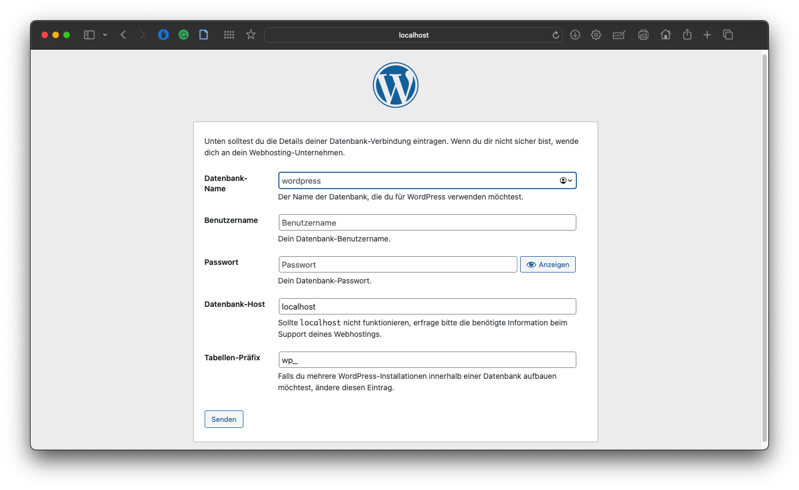

# LAB3

## General

Set up the software „Wordpress“ with external MySQL DB in 2 containers. This task consists of 2 parts. In each of the parts the same software is provided by means of container, whereby the containers in part 2 have to be created yourself.

Part 1:
- Creation of a Docker-Compose file which uses Wordpress and MySQL images to set up a Wordpress container infrastructure.

Part 2:
- Creating your own images based on debian for a Wordpress container installation.
  - Apache + PHP + Wordpress
  - MySQL
- Both images require persistent volumes. Wordpress to manage the uploaded files and config, MySQL to keep the database persistent.  The two containers should be able to communicate via TCP/IP. Note the corresponding ports.

## Steps Part 1

1. Create docker-compose.yaml file with two services "wordpress" and "MYSQL"<br><br>
   
2. Enter the command ```docker compose up -d``` 
   
3. After this command, the services started
   You can check the status with ```docker ps```
   

4. Afterwards, WordPress is available at the address: localhost:8080
   

5. Then follow the steps for the WordPress setup
   

6. After the successful wordpress setup, the wordpress dashboard is available after login
   

7. At least with the command ```docker compose stop``` you can stop all services
   

   Now all containers stopped
   

## Used Links for Part 1
- [Docker Docs](https://docs.docker.com/compose/gettingstarted/)

## Steps Part 2

1. Create the dockerfile for Wordpress and MYSQL

2. After that I created the docker-compose.yaml file <br><br>
   
3. With the command ```docker-compose up -d``` we can build all services
   
4. After that the wordpress setup is under localhost/wordpress available
   <br><br>
   <br><br>
   

## Used Links for Part 2
- [Docker Docs | Dockerfile best practices](https://docs.docker.com/develop/develop-images/dockerfile_best-practices/)
- [Docker Compose Build Command](https://docs.docker.com/engine/reference/commandline/compose_build/)


