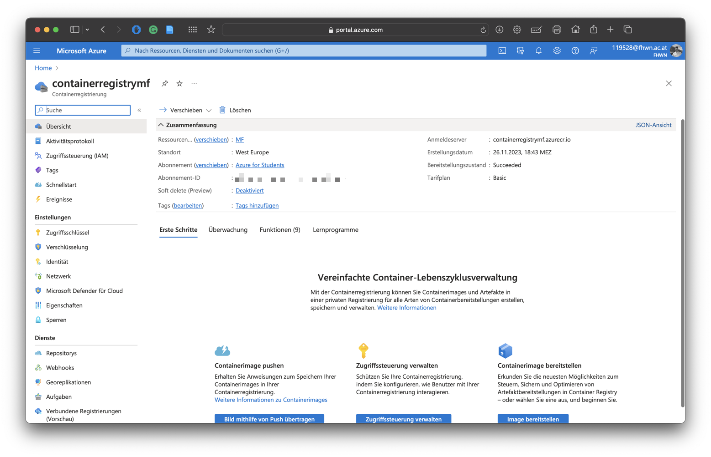
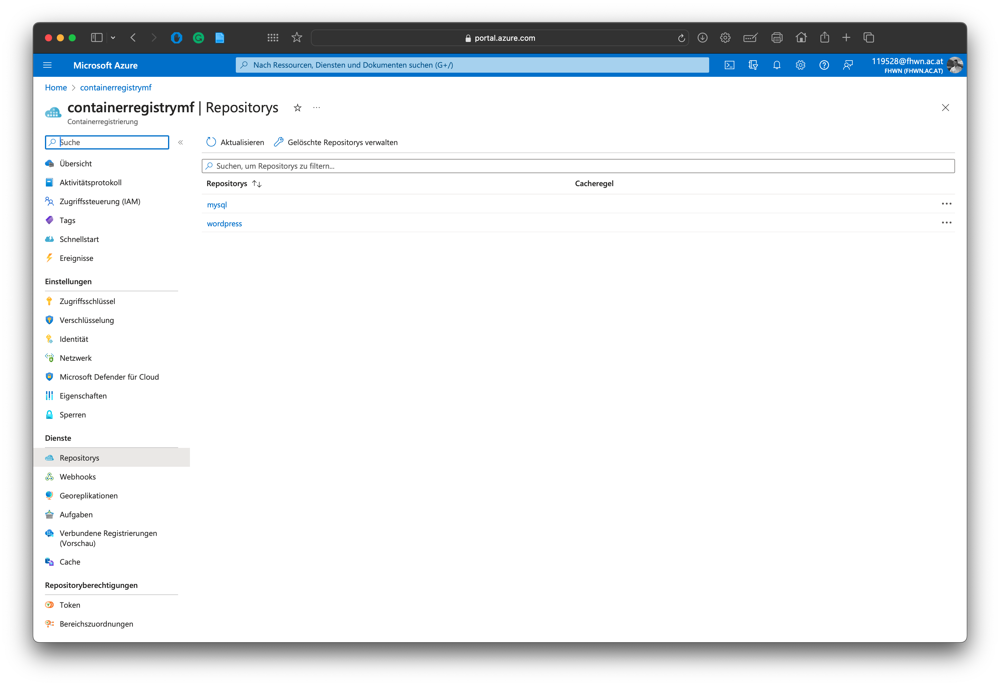
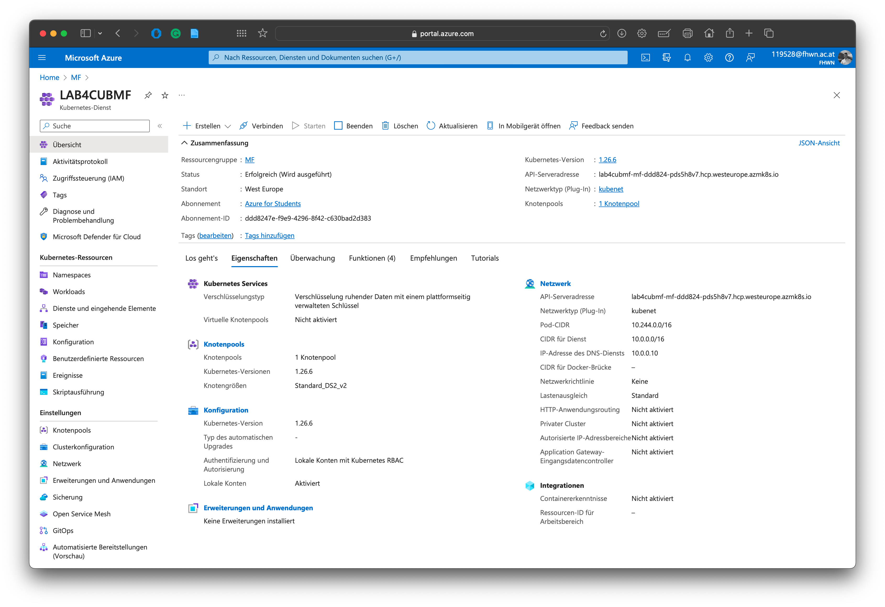
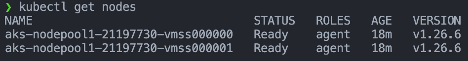
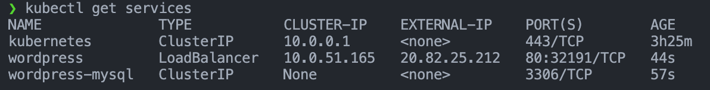
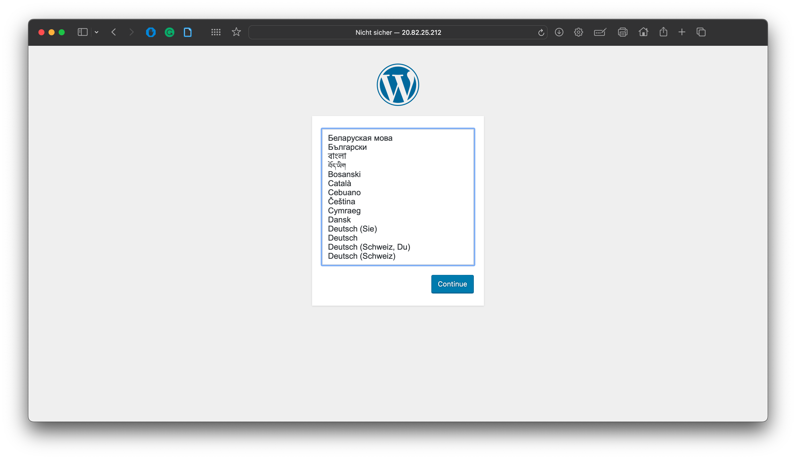
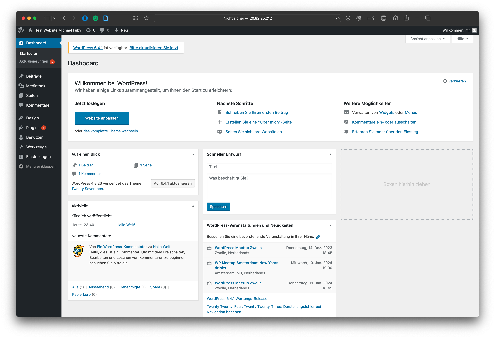

# Lab4

## General
- Setup and configuration of an AKS in Azure
- Configuration and deployment of Wordpress incl. MySQL in the AKS cluster.

## Steps Creation/Connection

1. First, we can create a new resource for the azure container registry with azure cli command ```az acr create --resource-group <resource-group-name> --name $ACRNAME --sku Basic```
   After that the created resource is in the Azure Portal available: 
   

   Then we build our application with ```docker-compose build``` <br><br>

   Tag the images with ```docker tag <local-image-name> <acr-login-server>/<repository-name>:<tag>```<br><br>

   Login to ACR with ```az acr login --name <acr-name>```<br><br>

   Push images to ACR with ```docker push <acr-login-server>/<repository-name>:<tag>```<br><br>

   After this steps we can see the images in the azure container registry:

   

2. Now we can create the with the az cli command 
    ```az aks create --resource-group <resource-group-name> --name <aks-cluster-name> --node-count 2 --generate-ssh-keys --attach-acr <acrName> ``` <br><br>
   Then the AKS resource are created:
   

3. Furthermore we must install the Kubernetes CLI with the command ```az aks install-cli``` <br>
   Test to ensure the version you installed is up-to-date: ```kubectl version --client``` <br><br>

4. In this step we connect to cluster using kubectl ```az aks get-credentials --resource-group <resource-group-name> --name <aks-cluster-name>``` <br>
   Then we verify the connection to our cluster using the kubectl get nodes command, which returns a list of cluster nodes: ```kubectl get nodes``` <br>
   

## Steps Deployment

1. Now we are able to deploy an application to Azure Kubernetes Service (AKS) <br>
   Create the two .yaml-files: **mysql-deployment.yaml** and **wordpress-deployment.yaml** <br><br>

   The **mysql-deployment.yaml** defines Kubernetes resources for deploying a WordPress application with a MySQL database. 
   Here is a summary:

   1. Service (wordpress-mysql):
      - Type: Kubernetes Service
      - Metadata: Name is "wordpress-mysql", labels are set to "app: wordpress".
      - Specification:
         - Opens the port 3306.
         - Selects pods that correspond to the labels "app: wordpress" and "tier: mysql".
         - The ClusterIP is set to "None".

   2. PersistentVolumeClaim (mysql-pv-claim):
      - Type: Kubernetes PersistentVolumeClaim
      - Metadata: Name is "mysql-pv-claim", Labels are set to "app: wordpress".
      - Specification:
         - Claims a persistent storage of 20 GB with read-write access.
  
   3. Deployment (wordpress-mysql):
      - Type: Kubernetes Deployment
      - Metadata: Name is "wordpress-mysql", labels are set to "app: wordpress".
      - Specification:
         - Selects pods with labels "app: wordpress" and "tier: mysql".
         - Uses the "Recreate" strategy.
         - Template Specification:
            - Defines a container for MySQL version 5.6 with a root password from a secret key.
            - Opens port 3306 in the container.
            - Mounts a persistent store on "/var/lib/mysql".
         - Uses a PersistentVolumeClaim with the name "mysql-pv-claim" for the persistent storage. <br><br>
   
   In summary, this creates a Kubernetes application for WordPress with a MySQL database. The MySQL service is accessible via the "wordpress-mysql" service and the data is stored on a persistent storage space of 20 GB. The deployment controller ensures that the desired number of pods are deployed with the MySQL application.<br><br>

   The **wordpress-deployment.yaml** defines defines Kubernetes resources for deploying WordPress in a Kubernetes environment. 
   Here is a short summary:

   1. Service (wordpress-service.yaml):
      - Type: Service
      - Name: wordpress
      - Labels: app=wordpress
      - Ports: Forwards the traffic to port 80
      - Selector: Selects pods with the labels app=wordpress and tier=frontend
      - Type: LoadBalancer (enables external access to the service)

   2. PersistentVolumeClaim (wordpress-pv-claim.yaml):
      - Type: PersistentVolumeClaim
      - Name: wp-pv-claim
      - Labels: app=wordpress
      - Access mode: ReadWriteOnce
      - Resources: Requests 20 GB disk space

   3. Deployment (wordpress-deployment.yaml):
      - Type: Deployment
      - Name: wordpress
      - Labels: app=wordpress
      - Selector: Selects pods with the labels app=wordpress and tier=frontend
      - Strategy: Recreate (when updating, the existing pod is destroyed and recreated)
      - Template: Defines the pod template with the required containers and configurations:
      - Container: Uses the WordPress image (version 4.8-apache), sets environment variables for the database connection and the password secret key.
        - Ports: Forwards traffic to port 80.
        - VolumeMounts: Binds the PersistentVolumeClaim (wp-pv-claim) to the /var/www/html path in the container.

      - Volumes: Uses the PersistentVolumeClaim (wp-pv-claim) as persistent storage for the WordPress container. <br><br>

1. Define a password by using the following command: ```kubectl create secret generic mysql-pass --from-literal=password=<passwordhere>``` <br><br>

2. After that we can create pods with ```kubectl apply -f mysql-deployment.yaml``` and ```kubectl apply -f wordpress-deployment.yaml```

3. Then we must check if everything is running correctly with ```kubectl get services```
    <br><br>

4. At the end we can Start/Stop/Delete the Cluster
   Start the cluster with ```az aks start --name <clusterName> --resource-group <resourceGroupName>```<br><br>

   Stop the cluster with ```az aks stop --name <clusterName> --resource-group <resourceGroupName>```<br><br>

   Delete the cluster with ```az group delete --name <resourceGroupName> --yes --no-wait```<br><br>

5. You can access the website with the external IP
   Also we can get the info with ```kubectl get services``` <br>
    <br>
    <br><br>

   After the wordpress setup we can see the wordpress dashboard
    <br><br>


## Used Links
- [Prepare an application for Azure Kubernetes Service (AKS)](https://learn.microsoft.com/en-us/azure/aks/tutorial-kubernetes-prepare-app)
- [Deploy an Azure Kubernetes Service (AKS) cluster using Azure CLI](https://learn.microsoft.com/en-us/azure/aks/learn/quick-kubernetes-deploy-cli)
- [Deploy an Azure Kubernetes Service (AKS) cluster mysql wordpress](https://kubernetes.io/docs/tutorials/stateful-application/mysql-wordpress-persistent-volume/)


